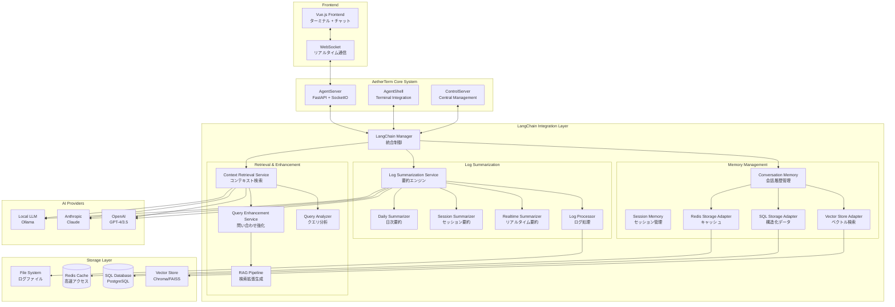
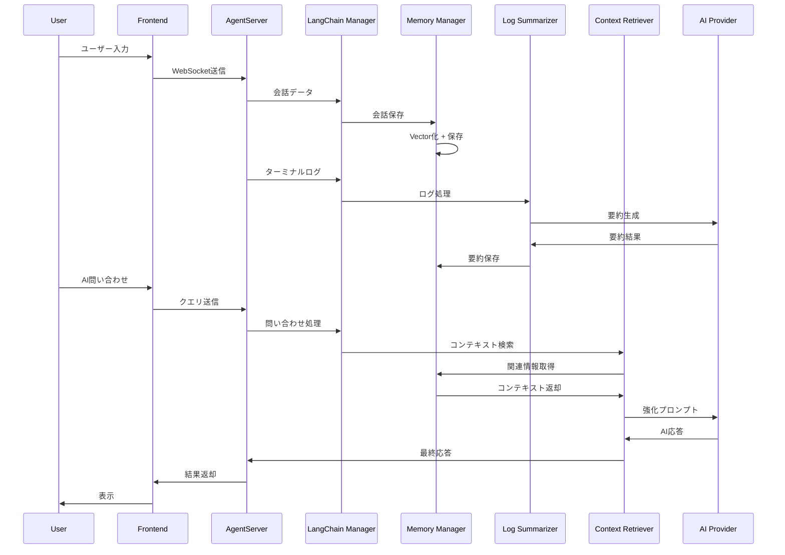
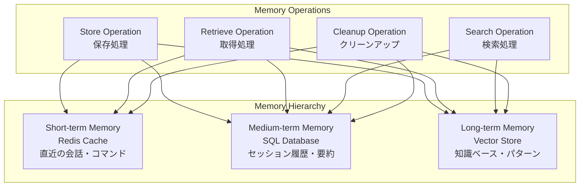
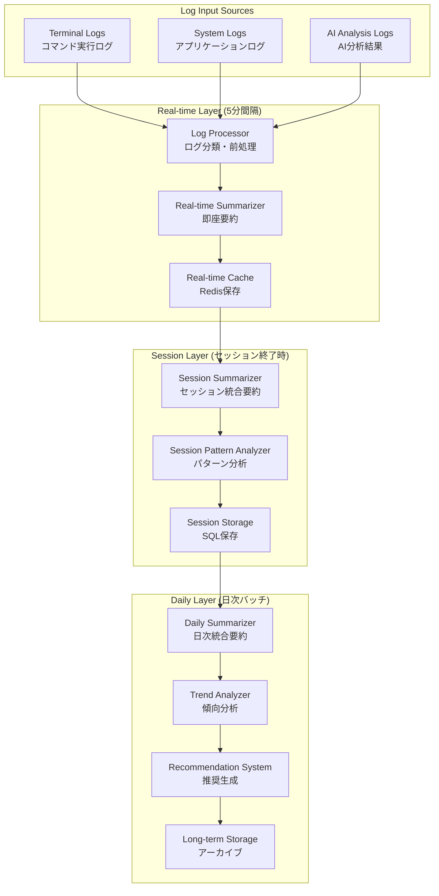
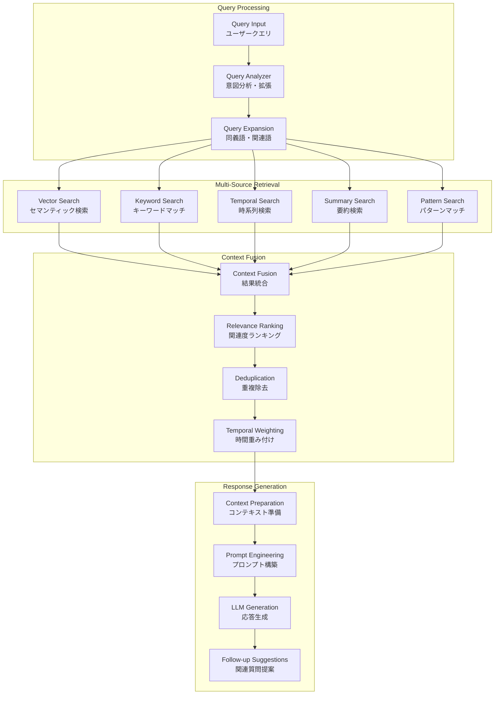
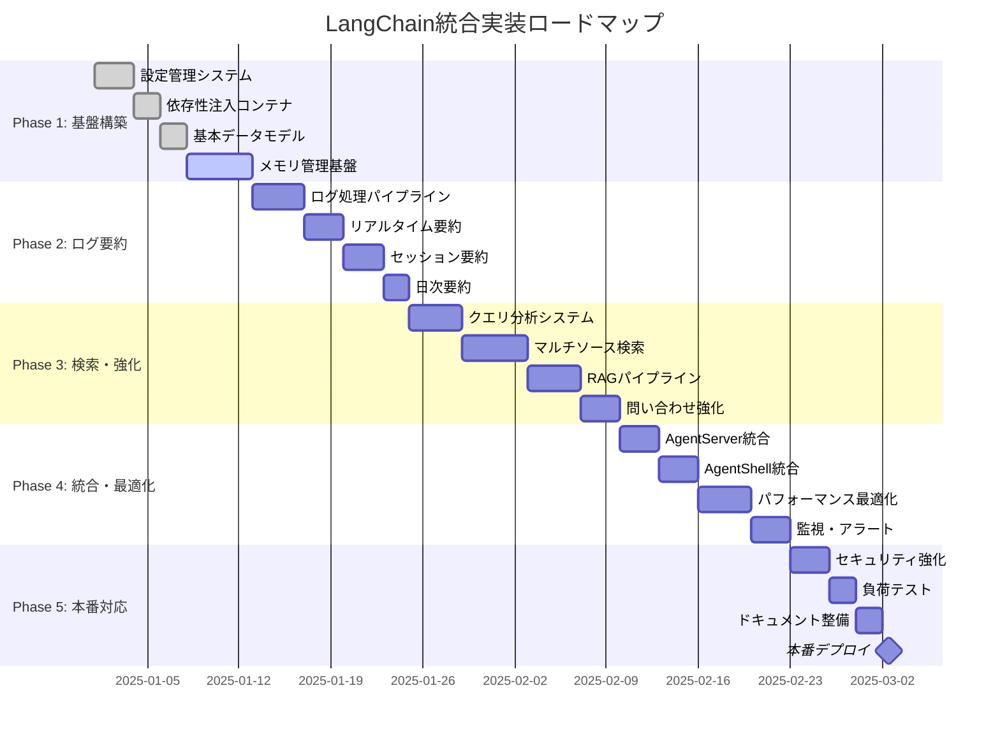

# LangChain統合アーキテクチャ - 包括的設計書

## 1. エグゼクティブサマリー

### 1.1 プロジェクト概要
AetherTermプロジェクトにLangChainを統合し、以下の機能を提供する包括的なAIメモリ・要約・検索システムを構築します：

- **階層化メモリ管理**: 短期・中期・長期メモリの統合管理
- **3層要約システム**: リアルタイム・セッション・日次要約
- **高度な検索・問い合わせ**: RAGパイプラインによる文脈理解型AI支援

### 1.2 設計原則
- **モジュラー設計**: 既存システムとの独立性確保
- **スケーラビリティ**: 大量データ処理対応
- **テスト可能性**: 包括的なTDD実装
- **セキュリティ**: データ暗号化・アクセス制御
- **パフォーマンス**: 低レイテンシ・高スループット

## 2. システムアーキテクチャ概要

### 2.1 全体アーキテクチャ図



### 2.2 データフロー設計



## 3. コンポーネント詳細設計

### 3.1 メモリ管理システム

#### 3.1.1 階層化メモリアーキテクチャ



#### 3.1.2 メモリ管理インターフェース

```python
# src/aetherterm/langchain/memory/memory_manager.py
class HierarchicalMemoryManager:
    """階層化メモリ管理クラス"""
    
    def __init__(self, config: LangChainConfig):
        self.short_term = RedisMemoryAdapter(config.redis_url)
        self.medium_term = SQLMemoryAdapter(config.sql_database_url)
        self.long_term = VectorMemoryAdapter(config.vector_store_path)
    
    async def store_conversation(
        self, 
        entry: ConversationEntry
    ) -> str:
        """会話を階層的に保存"""
        # 短期メモリ（即座にアクセス可能）
        await self.short_term.store(entry)
        
        # 中期メモリ（構造化データ）
        await self.medium_term.store(entry)
        
        # 長期メモリ（セマンティック検索用）
        embedding = await self._generate_embedding(entry.content)
        entry.embedding = embedding
        await self.long_term.store(entry)
        
        return str(entry.id)
    
    async def retrieve_context(
        self, 
        query: str, 
        session_id: str,
        strategy: MemoryStrategy = MemoryStrategy.HYBRID
    ) -> List[ContextEntry]:
        """コンテキストを階層的に検索"""
        contexts = []
        
        if strategy in [MemoryStrategy.SHORT_TERM, MemoryStrategy.HYBRID]:
            # 短期メモリから最新情報
            recent = await self.short_term.get_recent(session_id, limit=5)
            contexts.extend(recent)
        
        if strategy in [MemoryStrategy.SEMANTIC, MemoryStrategy.HYBRID]:
            # 長期メモリからセマンティック検索
            similar = await self.long_term.similarity_search(query, limit=10)
            contexts.extend(similar)
        
        if strategy in [MemoryStrategy.STRUCTURED, MemoryStrategy.HYBRID]:
            # 中期メモリから構造化検索
            structured = await self.medium_term.search(query, session_id)
            contexts.extend(structured)
        
        return self._deduplicate_and_rank(contexts, query)
```

### 3.2 ログ要約システム

#### 3.2.1 3層要約アーキテクチャ



#### 3.2.2 要約チェーン設計

```python
# src/aetherterm/langchain/summarization/chain_factory.py
class SummarizationChainFactory:
    """要約チェーン生成ファクトリ"""
    
    def create_realtime_chain(self) -> LLMChain:
        """リアルタイム要約チェーン"""
        prompt = ChatPromptTemplate.from_messages([
            ("system", """ターミナルログを簡潔に要約してください。
            重点項目：
            1. 実行されたコマンドの種類と目的
            2. エラーや警告の内容
            3. 注目すべき操作や結果
            
            要約は200文字以内で、技術的に正確に記述してください。"""),
            ("user", "ログ:\n{logs}\n\n要約:")
        ])
        
        return LLMChain(
            llm=self.llm,
            prompt=prompt,
            output_parser=StrOutputParser()
        )
    
    def create_session_chain(self) -> LLMChain:
        """セッション要約チェーン"""
        prompt = ChatPromptTemplate.from_messages([
            ("system", """セッション全体を分析し、包括的な要約を作成してください。
            分析観点：
            1. セッションの主要目的と達成度
            2. 実行されたワークフローの流れ
            3. 発生した問題と解決方法
            4. 学習ポイントと改善提案
            5. 次回セッションへの引き継ぎ事項
            
            要約は500文字以内で、構造化して記述してください。"""),
            ("user", "リアルタイム要約:\n{realtime_summaries}\n\n統計情報:\n{statistics}\n\nセッション要約:")
        ])
        
        return LLMChain(llm=self.llm, prompt=prompt)
    
    def create_daily_chain(self) -> LLMChain:
        """日次要約チェーン"""
        prompt = ChatPromptTemplate.from_messages([
            ("system", """1日の活動全体を俯瞰し、洞察に富んだ要約を作成してください。
            分析観点：
            1. 日次の主要成果と進捗
            2. 生産性パターンと効率性
            3. 技術的学習と成長
            4. 問題パターンと解決策
            5. 明日への戦略的提案
            
            要約は800文字以内で、戦略的視点を含めて記述してください。"""),
            ("user", "セッション要約:\n{session_summaries}\n\n日次統計:\n{daily_stats}\n\n日次要約:")
        ])
        
        return LLMChain(llm=self.llm, prompt=prompt)
```

### 3.3 検索・問い合わせシステム

#### 3.3.1 RAGパイプライン設計



#### 3.3.2 検索戦略実装

```python
# src/aetherterm/langchain/retrieval/search_strategy.py
class HybridSearchStrategy:
    """ハイブリッド検索戦略"""
    
    def __init__(self, config: LangChainConfig):
        self.config = config
        self.strategies = {
            'semantic': SemanticSearchStrategy(),
            'keyword': KeywordSearchStrategy(),
            'temporal': TemporalSearchStrategy(),
            'pattern': PatternSearchStrategy(),
            'summary': SummarySearchStrategy()
        }
    
    async def search(
        self, 
        query_analysis: QueryAnalysis,
        session_id: Optional[str] = None
    ) -> List[ContextEntry]:
        """ハイブリッド検索実行"""
        
        # 意図に基づく戦略重み決定
        strategy_weights = self._determine_strategy_weights(query_analysis.intent)
        
        # 並列検索実行
        search_tasks = []
        for strategy_name, weight in strategy_weights.items():
            if weight > 0:
                strategy = self.strategies[strategy_name]
                task = strategy.search(query_analysis, session_id, weight)
                search_tasks.append(task)
        
        # 結果統合
        results = await asyncio.gather(*search_tasks, return_exceptions=True)
        valid_results = [r for r in results if isinstance(r, list)]
        
        # 重み付き統合
        return self._weighted_merge(valid_results, strategy_weights)
    
    def _determine_strategy_weights(self, intent: QueryIntent) -> Dict[str, float]:
        """意図に基づく戦略重み決定"""
        weight_matrix = {
            QueryIntent.COMMAND_HELP: {
                'semantic': 0.4,
                'keyword': 0.3,
                'pattern': 0.2,
                'temporal': 0.1,
                'summary': 0.0
            },
            QueryIntent.ERROR_RESOLUTION: {
                'semantic': 0.5,
                'keyword': 0.2,
                'pattern': 0.1,
                'temporal': 0.2,
                'summary': 0.0
            },
            QueryIntent.WORKFLOW_GUIDANCE: {
                'semantic': 0.3,
                'keyword': 0.1,
                'pattern': 0.1,
                'temporal': 0.2,
                'summary': 0.3
            },
            # 他の意図...
        }
        
        return weight_matrix.get(intent, {
            'semantic': 0.4,
            'keyword': 0.3,
            'temporal': 0.2,
            'summary': 0.1,
            'pattern': 0.0
        })
```

## 4. 統合ポイント設計

### 4.1 AgentServer統合

```python
# src/aetherterm/langchain/integration/agentserver_plugin.py
class AgentServerLangChainPlugin:
    """AgentServer統合プラグイン"""
    
    def __init__(self, container: LangChainContainer):
        self.container = container
        self.memory_manager = container.conversation_memory_manager()
        self.summarizer = container.log_summarization_service()
        self.enhancer = container.query_enhancement_service()
    
    async def on_user_message(self, session_id: str, message: str) -> None:
        """ユーザーメッセージ受信時の処理"""
        await self.memory_manager.store_conversation(
            session_id=session_id,
            content=message,
            conversation_type=ConversationType.USER_INPUT,
            role=MessageRole.USER
        )
    
    async def on_ai_response(self, session_id: str, response: str) -> None:
        """AI応答時の処理"""
        await self.memory_manager.store_conversation(
            session_id=session_id,
            content=response,
            conversation_type=ConversationType.AI_RESPONSE,
            role=MessageRole.ASSISTANT
        )
    
    async def on_terminal_log(self, session_id: str, log_entry: str) -> None:
        """ターミナルログ受信時の処理"""
        # ログ要約システムに送信
        await self.summarizer.process_log_entry(session_id, log_entry)
    
    async def enhance_query(self, session_id: str, query: str) -> EnhancedQuery:
        """クエリ強化処理"""
        return await self.enhancer.enhance_query_with_context(query, session_id)
```

### 4.2 AgentShell統合

```python
# src/aetherterm/langchain/integration/agentshell_plugin.py
class AgentShellLangChainPlugin:
    """AgentShell統合プラグイン"""
    
    def __init__(self, container: LangChainContainer):
        self.container = container
        self.log_processor = container.log_processor()
        self.context_collector = ContextCollector()
    
    async def collect_terminal_context(self, session_id: str) -> Dict[str, Any]:
        """ターミナルコンテキスト収集"""
        return {
            'current_directory': os.getcwd(),
            'environment_vars': dict(os.environ),
            'running_processes': await self._get_running_processes(),
            'recent_commands': await self._get_recent_commands(session_id),
            'system_info': await self._get_system_info()
        }
    
    async def monitor_command_execution(
        self, 
        session_id: str, 
        command: str, 
        output: str, 
        exit_code: int
    ) -> None:
        """コマンド実行監視"""
        log_entry = LogEntry(
            timestamp=datetime.utcnow(),
            level=LogLevel.ERROR if exit_code != 0 else LogLevel.INFO,
            message=f"Command executed: {command}",
            source="terminal",
            session_id=session_id,
            metadata={
                'command': command,
                'output': output,
                'exit_code': exit_code,
                'context': await self.collect_terminal_context(session_id)
            }
        )
        
        await self.log_processor.add_log_entry(log_entry)
```

## 5. データベース設計

### 5.1 SQL スキーマ設計

```sql
-- 会話履歴テーブル
CREATE TABLE conversations (
    id UUID PRIMARY KEY DEFAULT gen_random_uuid(),
    session_id VARCHAR(255) NOT NULL,
    conversation_type VARCHAR(50) NOT NULL,
    role VARCHAR(20) NOT NULL,
    content TEXT NOT NULL,
    metadata JSONB DEFAULT '{}',
    timestamp TIMESTAMP WITH TIME ZONE DEFAULT NOW(),
    created_at TIMESTAMP WITH TIME ZONE DEFAULT NOW(),
    
    INDEX idx_conversations_session_id (session_id),
    INDEX idx_conversations_timestamp (timestamp),
    INDEX idx_conversations_type (conversation_type),
    INDEX idx_conversations_content_gin (content gin_trgm_ops)
);

-- セッションコンテキストテーブル
CREATE TABLE session_contexts (
    session_id VARCHAR(255) PRIMARY KEY,
    user_id VARCHAR(255),
    start_time TIMESTAMP WITH TIME ZONE DEFAULT NOW(),
    last_activity TIMESTAMP WITH TIME ZONE DEFAULT NOW(),
    conversation_count INTEGER DEFAULT 0,
    metadata JSONB DEFAULT '{}',
    
    INDEX idx_session_contexts_user_id (user_id),
    INDEX idx_session_contexts_last_activity (last_activity)
);

-- ログ要約テーブル
CREATE TABLE log_summaries (
    id UUID PRIMARY KEY DEFAULT gen_random_uuid(),
    session_id VARCHAR(255) NOT NULL,
    summary_type VARCHAR(20) NOT NULL,
    content TEXT NOT NULL,
    log_count INTEGER DEFAULT 0,
    start_time TIMESTAMP WITH TIME ZONE,
    end_time TIMESTAMP WITH TIME ZONE,
    metadata JSONB DEFAULT '{}',
    created_at TIMESTAMP WITH TIME ZONE DEFAULT NOW(),
    
    INDEX idx_log_summaries_session_id (session_id),
    INDEX idx_log_summaries_type (summary_type),
    INDEX idx_log_summaries_created_at (created_at),
    INDEX idx_log_summaries_content_gin (content gin_trgm_ops)
);

-- ベクトル埋め込みテーブル（PostgreSQL + pgvector使用時）
CREATE TABLE embeddings (
    id UUID PRIMARY KEY DEFAULT gen_random_uuid(),
    content_id UUID NOT NULL,
    content_type VARCHAR(50) NOT NULL,
    embedding vector(1536), -- OpenAI embedding dimension
    metadata JSONB DEFAULT '{}',
    created_at TIMESTAMP WITH TIME ZONE DEFAULT NOW(),
    
    INDEX idx_embeddings_content_id (content_id),
    INDEX idx_embeddings_content_type (content_type)
);

-- ベクトル類似性検索用インデックス
CREATE INDEX idx_embeddings_vector_cosine ON embeddings 
USING ivfflat (embedding vector_cosine_ops) WITH (lists = 100);
```

### 5.2 Vector Store設計

```python
# src/aetherterm/langchain/storage/vector_store_manager.py
class VectorStoreManager:
    """ベクトルストア管理クラス"""
    
    def __init__(self, config: LangChainConfig):
        self.config = config
        self.store = self._initialize_vector_store()
        self.embeddings = self._initialize_embeddings()
    
    def _initialize_vector_store(self) -> VectorStore:
        """ベクトルストア初期化"""
        if self.config.vector_store_type == "chroma":
            return Chroma(
                persist_directory=self.config.vector_store_path,
                embedding_function=self.embeddings
            )
        elif self.config.vector_store_type == "faiss":
            return FAISS.load_local(
                self.config.vector_store_path,
                self.embeddings
            )
        elif self.config.vector_store_type == "pgvector":
            return PGVector(
                connection_string=self.config.sql_database_url,
                embedding_function=self.embeddings,
                collection_name="aetherterm_embeddings"
            )
        else:
            raise ValueError(f"Unsupported vector store: {self.config.vector_store_type}")
    
    async def add_documents(
        self, 
        documents: List[Document],
        batch_size: int = 100
    ) -> List[str]:
        """ドキュメントをバッチ追加"""
        document_ids = []
        
        for i in range(0, len(documents), batch_size):
            batch = documents[i:i + batch_size]
            batch_ids = await self.store.aadd_documents(batch)
            document_ids.extend(batch_ids)
        
        return document_ids
    
    async def similarity_search_with_score(
        self,
        query: str,
        k: int = 10,
        filter: Optional[Dict[str, Any]] = None
    ) -> List[Tuple[Document, float]]:
        """スコア付き類似性検索"""
        return await self.store.asimilarity_search_with_score(
            query=query,
            k=k,
            filter=filter
        )
```

## 6. パフォーマンス最適化設計

### 6.1 キャッシュ戦略

```python
# src/aetherterm/langchain/cache/cache_manager.py
class CacheManager:
    """キャッシュ管理クラス"""
    
    def __init__(self, redis_client: Redis):
        self.redis = redis_client
        self.cache_ttl = {
            'conversation': 3600,      # 1時間
            'summary': 86400,          # 24時間
            'embedding': 604800,       # 1週間
            'search_result': 1800      # 30分
        }
    
    async def get_cached_embedding(self, content: str) -> Optional[List[float]]:
        """埋め込みキャッシュ取得"""
        cache_key = f"embedding:{hashlib.md5(content.encode()).hexdigest()}"
        cached = await self.redis.get(cache_key)
        
        if cached:
            return json.loads(cached)
        return None
    
    async def cache_embedding(self, content: str, embedding: List[float]) -> None:
        """埋め込みキャッシュ保存"""
        cache_key = f"embedding:{hashlib.md5(content.encode()).hexdigest()}"
        await self.redis.setex(
            cache_key,
            self.cache_ttl['embedding'],
            json.dumps(embedding)
        )
    
    async def get_cached_search_result(
        self, 
        query: str, 
        filters: Dict[str, Any]
    ) -> Optional[List[ContextEntry]]:
        """検索結果キャッシュ取得"""
        cache_key = f"search:{hashlib.md5(f'{query}:{json.dumps(filters, sort_keys=True)}'.encode()).hexdigest()}"
        cached = await self.redis.get(cache_key)
        
        if cached:
            data = json.loads(cached)
            return [ContextEntry(**item) for item in data]
        return None
```

### 6.2 非同期処理最適化

```python
# src/aetherterm/langchain/async_processing/task_manager.py
class AsyncTaskManager:
    """非同期タスク管理クラス"""
    
    def __init__(self, max_concurrent_tasks: int = 10):
        self.semaphore = asyncio.Semaphore(max_concurrent_tasks)
        self.task_queue = asyncio.Queue()
        self.workers = []
    
    async def start_workers(self, num_workers: int = 3) -> None:
        """ワーカー開始"""
        for i in range(num_workers):
            worker = asyncio.create_task(self._worker(f"worker-{i}"))
            self.workers.append(worker
)
    
    async def _worker(self, name: str) -> None:
        """ワーカータスク"""
        while True:
            try:
                task_func, args, kwargs = await self.task_queue.get()
                async with self.semaphore:
                    await task_func(*args, **kwargs)
                self.task_queue.task_done()
            except Exception as e:
                logger.error(f"Worker {name} error: {e}")
    
    async def submit_task(self, task_func, *args, **kwargs) -> None:
        """タスク投入"""
        await self.task_queue.put((task_func, args, kwargs))
```

## 7. エラーハンドリング・レジリエンス設計

### 7.1 階層化エラーハンドリング

```python
# src/aetherterm/langchain/error_handling/error_manager.py
class LangChainErrorManager:
    """LangChain統合エラー管理クラス"""
    
    def __init__(self, config: LangChainConfig):
        self.config = config
        self.retry_config = {
            'max_retries': 3,
            'backoff_factor': 2,
            'timeout': 30
        }
        self.circuit_breakers = {}
    
    async def handle_llm_error(self, error: Exception, context: Dict[str, Any]) -> Any:
        """LLMエラーハンドリング"""
        if isinstance(error, openai.RateLimitError):
            # レート制限エラー - 指数バックオフで再試行
            return await self._exponential_backoff_retry(context['operation'], context)
        elif isinstance(error, openai.APITimeoutError):
            # タイムアウトエラー - より短いプロンプトで再試行
            return await self._fallback_with_shorter_prompt(context)
        elif isinstance(error, openai.APIConnectionError):
            # 接続エラー - 代替プロバイダーに切り替え
            return await self._switch_to_fallback_provider(context)
        else:
            # その他のエラー - ログ記録とフォールバック応答
            logger.error(f"LLM error: {error}", extra=context)
            return self._generate_fallback_response(context)
    
    async def handle_storage_error(self, error: Exception, operation: str) -> bool:
        """ストレージエラーハンドリング"""
        if isinstance(error, redis.ConnectionError):
            # Redis接続エラー - メモリキャッシュにフォールバック
            logger.warning("Redis connection failed, falling back to memory cache")
            return await self._fallback_to_memory_cache(operation)
        elif isinstance(error, sqlalchemy.exc.OperationalError):
            # DB接続エラー - 読み取り専用モードに切り替え
            logger.error("Database connection failed, switching to read-only mode")
            return await self._switch_to_readonly_mode(operation)
        else:
            logger.error(f"Storage error in {operation}: {error}")
            return False
```

### 7.2 サーキットブレーカーパターン

```python
# src/aetherterm/langchain/resilience/circuit_breaker.py
class CircuitBreaker:
    """サーキットブレーカー実装"""
    
    def __init__(self, failure_threshold: int = 5, timeout: int = 60):
        self.failure_threshold = failure_threshold
        self.timeout = timeout
        self.failure_count = 0
        self.last_failure_time = None
        self.state = "CLOSED"  # CLOSED, OPEN, HALF_OPEN
    
    async def call(self, func, *args, **kwargs):
        """サーキットブレーカー経由での関数呼び出し"""
        if self.state == "OPEN":
            if self._should_attempt_reset():
                self.state = "HALF_OPEN"
            else:
                raise CircuitBreakerOpenError("Circuit breaker is OPEN")
        
        try:
            result = await func(*args, **kwargs)
            self._on_success()
            return result
        except Exception as e:
            self._on_failure()
            raise e
    
    def _should_attempt_reset(self) -> bool:
        """リセット試行判定"""
        return (
            self.last_failure_time and
            time.time() - self.last_failure_time >= self.timeout
        )
    
    def _on_success(self) -> None:
        """成功時の処理"""
        self.failure_count = 0
        self.state = "CLOSED"
    
    def _on_failure(self) -> None:
        """失敗時の処理"""
        self.failure_count += 1
        self.last_failure_time = time.time()
        
        if self.failure_count >= self.failure_threshold:
            self.state = "OPEN"
```

## 8. セキュリティ・プライバシー設計

### 8.1 データ暗号化・アクセス制御

```python
# src/aetherterm/langchain/security/security_manager.py
class SecurityManager:
    """セキュリティ管理クラス"""
    
    def __init__(self, config: LangChainConfig):
        self.config = config
        self.encryption_key = self._load_encryption_key()
        self.access_policies = self._load_access_policies()
    
    def encrypt_sensitive_content(self, content: str) -> str:
        """機密コンテンツ暗号化"""
        fernet = Fernet(self.encryption_key)
        return fernet.encrypt(content.encode()).decode()
    
    def decrypt_sensitive_content(self, encrypted_content: str) -> str:
        """機密コンテンツ復号化"""
        fernet = Fernet(self.encryption_key)
        return fernet.decrypt(encrypted_content.encode()).decode()
    
    async def check_access_permission(
        self, 
        user_id: str, 
        resource_type: str, 
        operation: str
    ) -> bool:
        """アクセス権限チェック"""
        user_permissions = self.access_policies.get(user_id, {})
        resource_permissions = user_permissions.get(resource_type, [])
        return operation in resource_permissions
    
    def sanitize_query_input(self, query: str) -> str:
        """クエリ入力サニタイゼーション"""
        # SQLインジェクション対策
        sanitized = re.sub(r'[;\'"\\]', '', query)
        # XSS対策
        sanitized = html.escape(sanitized)
        # 長さ制限
        return sanitized[:1000]
    
    def audit_log_access(
        self, 
        user_id: str, 
        resource_type: str, 
        operation: str, 
        success: bool
    ) -> None:
        """アクセス監査ログ"""
        audit_entry = {
            'timestamp': datetime.utcnow().isoformat(),
            'user_id': user_id,
            'resource_type': resource_type,
            'operation': operation,
            'success': success,
            'ip_address': self._get_client_ip()
        }
        logger.info(f"AUDIT: {json.dumps(audit_entry)}")
```

## 9. 監視・テレメトリー・ヘルスチェック

### 9.1 包括的監視システム

```python
# src/aetherterm/langchain/monitoring/monitoring_system.py
class MonitoringSystem:
    """包括的監視システム"""
    
    def __init__(self, config: LangChainConfig):
        self.config = config
        self.metrics_collector = MetricsCollector()
        self.health_checker = HealthChecker()
        self.alert_manager = AlertManager()
    
    async def start_monitoring(self) -> None:
        """監視開始"""
        # メトリクス収集開始
        asyncio.create_task(self._metrics_collection_loop())
        
        # ヘルスチェック開始
        asyncio.create_task(self._health_check_loop())
        
        # アラート監視開始
        asyncio.create_task(self._alert_monitoring_loop())
    
    async def _metrics_collection_loop(self) -> None:
        """メトリクス収集ループ"""
        while True:
            try:
                # システムメトリクス収集
                await self._collect_system_metrics()
                
                # アプリケーションメトリクス収集
                await self._collect_application_metrics()
                
                # パフォーマンスメトリクス収集
                await self._collect_performance_metrics()
                
                await asyncio.sleep(60)  # 1分間隔
            except Exception as e:
                logger.error(f"Metrics collection error: {e}")
    
    async def _collect_system_metrics(self) -> None:
        """システムメトリクス収集"""
        import psutil
        
        # CPU使用率
        cpu_percent = psutil.cpu_percent(interval=1)
        self.metrics_collector.record_gauge('system_cpu_percent', cpu_percent)
        
        # メモリ使用率
        memory = psutil.virtual_memory()
        self.metrics_collector.record_gauge('system_memory_percent', memory.percent)
        
        # ディスク使用率
        disk = psutil.disk_usage('/')
        self.metrics_collector.record_gauge('system_disk_percent', disk.percent)
    
    async def _collect_application_metrics(self) -> None:
        """アプリケーションメトリクス収集"""
        # アクティブセッション数
        active_sessions = await self._get_active_session_count()
        self.metrics_collector.record_gauge('active_sessions', active_sessions)
        
        # 処理中タスク数
        pending_tasks = await self._get_pending_task_count()
        self.metrics_collector.record_gauge('pending_tasks', pending_tasks)
        
        # キャッシュヒット率
        cache_hit_rate = await self._calculate_cache_hit_rate()
        self.metrics_collector.record_gauge('cache_hit_rate', cache_hit_rate)
```

### 9.2 アラート・通知システム

```python
# src/aetherterm/langchain/monitoring/alert_manager.py
class AlertManager:
    """アラート管理クラス"""
    
    def __init__(self, config: LangChainConfig):
        self.config = config
        self.alert_rules = self._load_alert_rules()
        self.notification_channels = self._setup_notification_channels()
    
    async def evaluate_alerts(self, metrics: Dict[str, float]) -> None:
        """アラート評価"""
        for rule_name, rule in self.alert_rules.items():
            try:
                if self._evaluate_rule(rule, metrics):
                    await self._trigger_alert(rule_name, rule, metrics)
            except Exception as e:
                logger.error(f"Alert evaluation error for {rule_name}: {e}")
    
    def _evaluate_rule(self, rule: Dict[str, Any], metrics: Dict[str, float]) -> bool:
        """アラートルール評価"""
        metric_name = rule['metric']
        threshold = rule['threshold']
        operator = rule['operator']
        
        if metric_name not in metrics:
            return False
        
        metric_value = metrics[metric_name]
        
        if operator == 'gt':
            return metric_value > threshold
        elif operator == 'lt':
            return metric_value < threshold
        elif operator == 'eq':
            return metric_value == threshold
        else:
            return False
    
    async def _trigger_alert(
        self, 
        rule_name: str, 
        rule: Dict[str, Any], 
        metrics: Dict[str, float]
    ) -> None:
        """アラート発火"""
        alert_data = {
            'rule_name': rule_name,
            'severity': rule.get('severity', 'warning'),
            'message': rule.get('message', f"Alert triggered: {rule_name}"),
            'metrics': metrics,
            'timestamp': datetime.utcnow().isoformat()
        }
        
        # 通知送信
        for channel in self.notification_channels:
            await channel.send_alert(alert_data)
```

## 10. 設定管理・環境対応

### 10.1 階層化設定システム

```toml
# config/langchain.toml - 本番環境設定
[langchain]
enabled = true
debug = false
log_level = "INFO"
environment = "production"

[langchain.memory]
retention_days = 90
max_conversations_per_session = 1000
vector_store_type = "pgvector"
vector_store_path = "${VECTOR_STORE_PATH}"
sql_database_url = "${DATABASE_URL}"
redis_url = "${REDIS_URL}"

[langchain.summarization]
realtime_interval_minutes = 5
max_log_entries_per_summary = 2000
summarization_model = "gpt-4"
summary_max_tokens = 1000
batch_processing_enabled = true
batch_size = 100

[langchain.retrieval]
similarity_threshold = 0.75
max_context_entries = 10
embedding_model = "text-embedding-ada-002"
search_timeout_seconds = 15
enable_hybrid_search = true
cache_search_results = true

[langchain.providers]
openai_api_key = "${OPENAI_API_KEY}"
anthropic_api_key = "${ANTHROPIC_API_KEY}"
default_provider = "openai"
fallback_provider = "anthropic"
rate_limit_requests_per_minute = 100

[langchain.security]
encryption_enabled = true
encryption_key = "${LANGCHAIN_ENCRYPTION_KEY}"
access_control_enabled = true
audit_logging_enabled = true
data_retention_policy = "encrypt_and_archive"

[langchain.performance]
max_concurrent_tasks = 20
connection_pool_size = 50
cache_ttl_seconds = 7200
enable_compression = true
batch_processing_enabled = true

[langchain.monitoring]
metrics_enabled = true
health_check_interval_seconds = 30
alert_thresholds = { 
    error_rate = 0.02, 
    response_time_p95 = 1.5,
    memory_usage = 0.85,
    cpu_usage = 0.80
}
```

### 10.2 動的設定管理

```python
# src/aetherterm/langchain/config/dynamic_config.py
class DynamicConfigManager:
    """動的設定管理クラス"""
    
    def __init__(self, config_path: str):
        self.config_path = config_path
        self.config = self._load_config()
        self.watchers = []
        self.last_modified = os.path.getmtime(config_path)
        
        # 設定変更監視開始
        asyncio.create_task(self._watch_config_changes())
    
    async def _watch_config_changes(self) -> None:
        """設定変更監視"""
        while True:
            try:
                current_modified = os.path.getmtime(self.config_path)
                if current_modified > self.last_modified:
                    await self._reload_config()
                    self.last_modified = current_modified
                
                await asyncio.sleep(5)  # 5秒間隔でチェック
            except Exception as e:
                logger.error(f"Config watching error: {e}")
    
    async def _reload_config(self) -> None:
        """設定再読み込み"""
        try:
            new_config = self._load_config()
            old_config = self.config
            self.config = new_config
            
            # 変更通知
            for watcher in self.watchers:
                await watcher(new_config, old_config)
            
            logger.info("Configuration reloaded successfully")
        except Exception as e:
            logger.error(f"Failed to reload configuration: {e}")
    
    def register_change_handler(self, handler: Callable) -> None:
        """設定変更ハンドラー登録"""
        self.watchers.append(handler)
    
    def get_config_value(self, key_path: str, default=None):
        """設定値取得（ドット記法対応）"""
        keys = key_path.split('.')
        value = self.config
        
        for key in keys:
            if isinstance(value, dict) and key in value:
                value = value[key]
            else:
                return default
        
        return value
```

## 11. テスト戦略・品質保証

### 11.1 包括的テスト設計

```python
# tests/langchain/integration/test_comprehensive_flow.py
class TestLangChainComprehensiveFlow:
    """LangChain包括的フローテスト"""
    
    @pytest.mark.asyncio
    async def test_end_to_end_conversation_flow(self, langchain_container):
        """エンドツーエンド会話フローテスト"""
        # 1. 初期設定
        memory_manager = langchain_container.conversation_memory_manager()
        summarizer = langchain_container.log_summarization_service()
        retriever = langchain_container.context_retrieval_service()
        enhancer = langchain_container.query_enhancement_service()
        
        session_id = "test-e2e-session"
        
        # 2. 会話データ投入
        conversations = [
            ("How do I use git rebase?", ConversationType.USER_INPUT),
            ("Git rebase allows you to rewrite commit history...", ConversationType.AI_RESPONSE),
            ("What about interactive rebase?", ConversationType.USER_INPUT),
            ("Interactive rebase with -i flag lets you...", ConversationType.AI_RESPONSE)
        ]
        
        for content, conv_type in conversations:
            await memory_manager.store_conversation(
                session_id=session_id,
                content=content,
                conversation_type=conv_type
            )
        
        # 3. ログ要約テスト
        log_entries = [
            LogEntry(
                timestamp=datetime.utcnow(),
                level=LogLevel.INFO,
                message="Command executed: git rebase -i HEAD~3",
                source="terminal",
                session_id=session_id,
                metadata={}
            )
        ]
        
        summary = await summarizer.create_realtime_summary(log_entries, session_id)
        assert summary.content is not None
        assert summary.log_count == 1
        
        # 4. コンテキスト検索テスト
        search_result = await retriever.retrieve_relevant_context(
            query="git rebase interactive mode",
            session_id=session_id
        )
        
        assert len(search_result.contexts) > 0
        assert search_result.search_time_ms > 0
        
        # 5. クエリ強化テスト
        enhanced_query = await enhancer.enhance_query_with_context(
            query="How to squash commits?",
            session_id=session_id
        )
        
        assert enhanced_query.original_query == "How to squash commits?"
        assert len(enhanced_query.relevant_contexts) > 0
        assert enhanced_query.confidence > 0.5
    
    @pytest.mark.asyncio
    async def test_performance_benchmarks(self, langchain_container):
        """パフォーマンスベンチマークテスト"""
        memory_manager = langchain_container.conversation_memory_manager()
        
        # 大量データ投入テスト
        start_time = time.time()
        
        tasks = []
        for i in range(100):
            task = memory_manager.store_conversation(
                session_id=f"perf-test-{i % 10}",
                content=f"Test message {i}",
                conversation_type=ConversationType.USER_INPUT
            )
            tasks.append(task)
        
        await asyncio.gather(*tasks)
        
        end_time = time.time()
        duration = end_time - start_time
        
        # パフォーマンス要件チェック
        assert duration < 10.0  # 100件の保存が10秒以内
        
        # 検索パフォーマンステスト
        search_start = time.time()
        
        search_tasks = []
        for i in range(20):
            task = memory_manager.search_similar_conversations(
                query=f"test query {i}",
                limit=5
            )
            search_tasks.append(task)
        
        await asyncio.gather(*search_tasks)
        
        search_end = time.time()
        search_duration = search_end - search_start
        
        assert search_duration < 5.0  # 20件の検索が5秒以内
```

### 11.2 品質メトリクス・SLA定義

```python
# src/aetherterm/langchain/quality/sla_monitor.py
class SLAMonitor:
    """SLA監視クラス"""
    
    def __init__(self):
        self.sla_targets = {
            'memory_store_latency_p95': 100,  # ms
            'search_latency_p95': 200,        # ms
            'summarization_latency_p95': 5000, # ms
            'availability': 99.9,              # %
            'error_rate': 0.1                  # %
        }
        self.metrics_window = timedelta(minutes=5)
    
    async def check_sla_compliance(self) -> Dict[str, bool]:
        """SLA準拠チェック"""
        compliance = {}
        
        for metric_name, target in self.sla_targets.items():
            current_value = await self._get_current_metric_value(metric_name)
            
            if metric_name.endswith('_latency_p95'):
                compliance[metric_name] = current_value <= target
            elif metric_name == 'availability':
                compliance[metric_name] = current_value >= target
            elif metric_name == 'error_rate':
                compliance[metric_name] = current_value <= target
        
        return compliance
    
    async def generate_sla_report(self) -> Dict[str, Any]:
        """SLAレポート生成"""
        compliance = await self.check_sla_compliance()
        
        return {
            'timestamp': datetime.utcnow().isoformat(),
            'compliance_status': all(compliance.values()),
            'individual_metrics': compliance,
            'overall_score': sum(compliance.values()) / len(compliance) * 100
        }
```

## 12. 実装ロードマップ・マイルストーン

### 12.1 フェーズ別実装計画



### 12.2 成功指標・KPI

```python
# src/aetherterm/langchain/metrics/kpi_tracker.py
class KPITracker:
    """KPI追跡クラス"""
    
    def __init__(self):
        self.kpis = {
            # 技術的KPI
            'system_availability': {'target': 99.9, 'unit': '%'},
            'average_response_time': {'target': 500, 'unit': 'ms'},
            'error_rate': {'target': 0.1, 'unit': '%'},
            'memory_usage_efficiency': {'target': 80, 'unit': '%'},
            
            # 機能的KPI
            'search_accuracy': {'target': 85, 'unit': '%'},
            'summarization_quality_score': {'target': 4.0, 'unit': '/5'},
            'context_relevance_score': {'target': 0.8, 'unit': '/1'},
            'user_satisfaction_score': {'target': 4.2, 'unit': '/5'},
            
            # ビジネスKPI
            'daily_active_sessions': {'target': 100, 'unit': 'sessions'},
            'query_enhancement_usage': {'target': 70, 'unit': '%'},
            'cost_per_query': {'target': 0.01, 'unit': 'USD'},
            'feature_adoption_rate': {'target': 60, 'unit': '%'}
        }
    
    async def calculate_current_kpis(self) -> Dict[str, Dict[str, Any]]:
        """現在のKPI計算"""
        current_kpis = {}
        
        for kpi_name, kpi_config in self.kpis.items():
            current_value = await self._calculate_kpi_value(kpi_name)
            target_value = kpi_config['target']
            
            current_kpis[kpi_name] = {
                'current': current_value,
                'target': target_value,
                'achievement_rate': (current_value / target_value) * 100,
                'status': 'achieved' if current_value >= target_value else 'below_target',
                'unit': kpi_config['unit']
            }
        
        return current_kpis
    
    async def generate_kpi_dashboard(self) -> Dict[str, Any]:
        """KPIダッシュボード生成"""
        kpis = await self.calculate_current_kpis()
        
        achieved_count = sum(1 for kpi in kpis.values() if kpi['status'] == 'achieved')
        total_count = len(kpis)
        
        return {
            'timestamp': datetime.utcnow().isoformat(),
            'overall_score': (achieved_count / total_count) * 100,
            'achieved_kpis': achieved_count,
            'total_kpis': total_count,
            'individual_kpis': kpis,
            'recommendations': await self._generate_improvement_recommendations(kpis)
        }
```

## 13. 結論・次のステップ

### 13.1 アーキテクチャサマリー

この包括的なLangChain統合アーキテクチャは、AetherTermプロジェクトに以下の価値を提供します：

1. **インテリジェントなメモリ管理**: 階層化されたメモリシステムによる効率的な情報保存・検索
2. **自動化されたログ要約**: 3層要約システムによる洞察に富んだ情報抽出
3. **高度な問い合わせ支援**: RAGパイプラインによる文脈理解型AI応答
4. **スケーラブルな設計**: 大量データ・高負荷に対応する拡張可能アーキテクチャ
5. **運用品質**: 包括的な監視・エラーハンドリング・セキュリティ対策

### 13.2 実装優先順位

1. **Phase 1 (基盤構築)**: メモリ管理システムの実装 - 最重要
2. **Phase 2 (ログ要約)**: リアルタイム要約機能の実装 - 高優先度
3. **Phase 3 (検索強化)**: RAGパイプラインの実装 - 中優先度
4. **Phase 4 (統合最適化)**: 既存システムとの統合 - 中優先度
5. **Phase 5 (本番対応)**: セキュリティ・監視の強化 - 必須

### 13.3 技術的考慮事項

- **依存関係管理**: LangChainエコシステムの急速な進化に対応
- **コスト最適化**: AI API使用量の監視と最適化
- **データプライバシー**: 機密情報の適切な処理と保護
- **スケーラビリティ**: 将来的な負荷増加への対応準備
- **互換性**: 既存AetherTermシステムとの完全な統合

### 13.4 リスク管理

- **技術リスク**: LangChain APIの変更、AI プロバイダーの制
限・変更
- **運用リスク**: 複雑性増加、監視・保守負荷
- **ビジネスリスク**: 実装遅延、予算超過

### 13.5 次のアクションアイテム

#### 即座に実行すべき項目
1. **技術検証**: LangChain最新版での概念実証実装
2. **リソース計画**: 開発チーム編成とスキル評価
3. **インフラ準備**: Vector Store・Redis・PostgreSQL環境構築
4. **セキュリティ評価**: データ保護要件の詳細分析

#### 短期実装項目（1-2週間）
1. **Phase 1開始**: 基盤設定とメモリ管理システム
2. **テスト環境構築**: CI/CD パイプライン整備
3. **監視基盤**: 基本的なメトリクス収集システム
4. **ドキュメント**: 開発者向けAPI仕様書作成

#### 中期実装項目（1-2ヶ月）
1. **Phase 2-3実装**: ログ要約・検索システム
2. **パフォーマンス最適化**: ボトルネック特定・改善
3. **セキュリティ強化**: 暗号化・アクセス制御実装
4. **統合テスト**: エンドツーエンドテスト実施

## 14. 付録

### 14.1 用語集

| 用語 | 定義 |
|------|------|
| **RAG** | Retrieval-Augmented Generation - 検索拡張生成 |
| **Vector Store** | 埋め込みベクトルを効率的に保存・検索するデータベース |
| **Embedding** | テキストを数値ベクトルに変換した表現 |
| **LLM** | Large Language Model - 大規模言語モデル |
| **Circuit Breaker** | 障害の連鎖を防ぐ設計パターン |
| **Semantic Search** | 意味的類似性に基づく検索 |
| **Hierarchical Memory** | 階層化されたメモリ管理システム |

### 14.2 参考資料

#### 技術文書
- [LangChain Documentation](https://python.langchain.com/)
- [OpenAI API Reference](https://platform.openai.com/docs/api-reference)
- [Chroma Vector Database](https://docs.trychroma.com/)
- [FastAPI Documentation](https://fastapi.tiangolo.com/)

#### 設計パターン
- [Microservices Patterns](https://microservices.io/patterns/)
- [Circuit Breaker Pattern](https://martinfowler.com/bliki/CircuitBreaker.html)
- [CQRS Pattern](https://martinfowler.com/bliki/CQRS.html)

#### ベストプラクティス
- [12-Factor App](https://12factor.net/)
- [Clean Architecture](https://blog.cleancoder.com/uncle-bob/2012/08/13/the-clean-architecture.html)
- [Domain-Driven Design](https://domainlanguage.com/ddd/)

### 14.3 設定テンプレート

#### 開発環境設定
```toml
# config/langchain.dev.toml
[langchain]
enabled = true
debug = true
log_level = "DEBUG"
environment = "development"

[langchain.memory]
retention_days = 7
max_conversations_per_session = 50
vector_store_type = "chroma"
vector_store_path = "./data/dev_vector_store"
sql_database_url = "sqlite:///./data/dev.db"
redis_url = "redis://localhost:6379/0"

[langchain.providers]
openai_api_key = "${OPENAI_API_KEY}"
default_provider = "openai"
rate_limit_requests_per_minute = 10

[langchain.monitoring]
metrics_enabled = false
health_check_interval_seconds = 300
```

#### テスト環境設定
```toml
# config/langchain.test.toml
[langchain]
enabled = true
debug = false
log_level = "INFO"
environment = "test"

[langchain.memory]
retention_days = 1
max_conversations_per_session = 10
vector_store_type = "chroma"
vector_store_path = ":memory:"
sql_database_url = "sqlite:///:memory:"
redis_url = "redis://localhost:6379/1"

[langchain.providers]
openai_api_key = "test-key"
default_provider = "mock"
rate_limit_requests_per_minute = 1000

[langchain.monitoring]
metrics_enabled = true
health_check_interval_seconds = 60
```

### 14.4 トラブルシューティングガイド

#### 一般的な問題と解決策

**問題**: Vector Store接続エラー
```
解決策:
1. Chroma/FAISSサービスの起動確認
2. 接続設定の確認
3. ファイアウォール設定の確認
4. ログファイルでの詳細エラー確認
```

**問題**: LLM API レート制限エラー
```
解決策:
1. API使用量の確認
2. レート制限設定の調整
3. 代替プロバイダーへの切り替え
4. リクエスト頻度の最適化
```

**問題**: メモリ使用量の急増
```
解決策:
1. キャッシュサイズの調整
2. 古いデータのクリーンアップ
3. バッチ処理サイズの最適化
4. メモリリーク箇所の特定
```

**問題**: 検索精度の低下
```
解決策:
1. 埋め込みモデルの再評価
2. 類似度閾値の調整
3. インデックスの再構築
4. クエリ前処理の改善
```

### 14.5 パフォーマンスチューニングガイド

#### メモリ最適化
```python
# メモリ使用量最適化設定例
MEMORY_OPTIMIZATION_CONFIG = {
    'batch_size': 50,           # バッチ処理サイズ
    'cache_ttl': 3600,          # キャッシュ有効期限
    'max_memory_usage': '2GB',  # 最大メモリ使用量
    'gc_threshold': 0.8,        # GC実行閾値
    'connection_pool_size': 20  # 接続プール サイズ
}
```

#### データベース最適化
```sql
-- インデックス最適化例
CREATE INDEX CONCURRENTLY idx_conversations_session_timestamp 
ON conversations(session_id, timestamp DESC);

CREATE INDEX CONCURRENTLY idx_embeddings_vector_hnsw 
ON embeddings USING hnsw (embedding vector_cosine_ops);

-- パーティショニング例
CREATE TABLE conversations_2025_01 PARTITION OF conversations
FOR VALUES FROM ('2025-01-01') TO ('2025-02-01');
```

#### キャッシュ戦略
```python
# Redis キャッシュ最適化
CACHE_STRATEGIES = {
    'embeddings': {
        'ttl': 604800,      # 1週間
        'max_size': '500MB',
        'eviction': 'lru'
    },
    'search_results': {
        'ttl': 1800,        # 30分
        'max_size': '100MB',
        'eviction': 'lfu'
    },
    'summaries': {
        'ttl': 86400,       # 24時間
        'max_size': '200MB',
        'eviction': 'ttl'
    }
}
```

---

## まとめ

この包括的なLangChain統合アーキテクチャ設計書は、AetherTermプロジェクトにおける高度なAIメモリ・要約・検索システムの実装指針を提供します。

**主要な成果物:**
- ✅ 階層化メモリ管理システムの詳細設計
- ✅ 3層ログ要約アーキテクチャの仕様
- ✅ RAGパイプラインによる高度検索システム
- ✅ 包括的な統合・運用・監視設計
- ✅ 段階的実装ロードマップ

**次のステップ:**
1. Phase 1（基盤構築）の即座開始
2. 技術検証とプロトタイプ開発
3. 開発チーム編成とリソース確保
4. 継続的な設計改善とフィードバック反映

この設計書を基に、AetherTermプロジェクトは次世代のインテリジェントターミナル体験を実現できます。