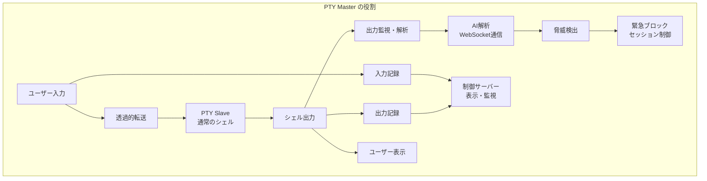
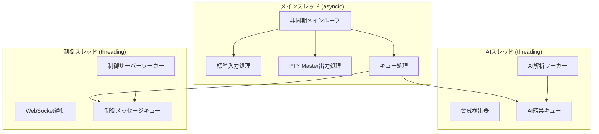

# PTY監査システム アーキテクチャ設計書

## 概要

AIサーバーの解析結果に基づくPTYログ表示ツール（ユーザー入出力監査・不正操作ブロッキングシステム）のアーキテクチャ設計書です。

## システム目的

- ユーザーの入出力を透過的に監査
- AIサーバーによるリアルタイム脅威解析
- 不正操作検出時の緊急ブロッキング
- 制御サーバーでのリアルタイム監視

## 基本アーキテクチャ

### 設計方針

**透過的PTYプロキシ**: ユーザー入力は即座にPTY Slaveに転送し、完全な透過性を保持
**入出力分離記録**: 入力記録と出力監視を分離して処理
**出力ベース監査**: コマンド実行結果の出力を解析して脅威検出



### 主要コンポーネント

#### TransparentPTYProxy
- 透過的プロキシメインループ
- 非ブロッキングI/O処理
- セッション状態管理

#### InputRecorder
- 入力データの記録（制御サーバー表示用）
- リアルタイム送信
- 監査ログ記録

#### OutputMonitor
- 出力データの監視・解析
- AI解析要求
- 脅威検出処理

#### SessionController
- 緊急ブロック制御
- 管理者承認待ち
- セッション終了処理

## PTY Master 実装方式

### 1. ハイブリッド方式（推奨実装）

**概要**: asyncio（非同期I/O）+ threading（CPU集約処理）の組み合わせ

#### 特徴
- **メインループ**: asyncioによる高効率な非同期I/O処理
- **AI解析**: 専用スレッドでCPU集約的な処理を分離
- **制御サーバー通信**: 専用スレッドでブロッキングI/Oを分離
- **スレッド間通信**: asyncio.Queueによる安全な通信

#### アーキテクチャ図



#### 実装例

```python
class HybridPTYMaster:
    """ハイブリッド方式PTY Master"""
    
    def __init__(self, session_id: str):
        self.session_id = session_id
        self.master_fd = None
        self.slave_fd = None
        self.child_pid = None
        
        # 非同期コンポーネント
        self.running = False
        self.tasks = []
        
        # スレッド間通信
        self.ai_queue = asyncio.Queue()
        self.control_queue = asyncio.Queue()
        self.ai_result_queue = asyncio.Queue()
        
        # バックグラウンドスレッド
        self.ai_thread = None
        self.control_thread = None
        
    async def start_session(self) -> None:
        """セッション開始"""
        try:
            # PTY作成
            self.master_fd, self.slave_fd = pty.openpty()
            
            # 子プロセス起動
            self.child_pid = await self._spawn_shell()
            
            # バックグラウンドスレッド開始
            self._start_background_threads()
            
            # 非同期メインループ
            await self._hybrid_main_loop()
            
        except Exception as e:
            logger.error(f"セッション開始エラー: {e}")
            await self.cleanup()
    
    async def _hybrid_main_loop(self) -> None:
        """ハイブリッドメインループ"""
        self.running = True
        
        # 非同期I/Oリーダー設定
        stdin_reader = asyncio.StreamReader()
        master_reader = asyncio.StreamReader()
        await self._setup_async_readers(stdin_reader, master_reader)
        
        while self.running:
            try:
                # 複数の非同期処理を並行実行
                done, pending = await asyncio.wait([
                    asyncio.create_task(self._handle_stdin_async(stdin_reader)),
                    asyncio.create_task(self._handle_master_async(master_reader)),
                    asyncio.create_task(self._handle_ai_results()),
                    asyncio.create_task(self._handle_control_messages()),
                    asyncio.create_task(self._monitor_session()),
                ], return_when=asyncio.FIRST_COMPLETED)
                
                # 完了タスクの処理
                for task in done:
                    try:
                        result = await task
                        if result is False:  # 終了シグナル
                            self.running = False
                            break
                    except Exception as e:
                        logger.error(f"タスク実行エラー: {e}")
                
                # 未完了タスクのキャンセル
                for task in pending:
                    task.cancel()
                    
            except Exception as e:
                logger.error(f"メインループエラー: {e}")
                break
    
    def _start_background_threads(self) -> None:
        """バックグラウンドスレッド開始"""
        # AI処理スレッド
        self.ai_thread = threading.Thread(
            target=self._ai_thread_worker,
            name=f"AIWorker-{self.session_id}",
            daemon=True
        )
        self.ai_thread.start()
        
        # 制御サーバー通信スレッド
        self.control_thread = threading.Thread(
            target=self._control_thread_worker,
            name=f"ControlWorker-{self.session_id}",
            daemon=True
        )
        self.control_thread.start()
    
    def _ai_thread_worker(self) -> None:
        """AI処理スレッドワーカー"""
        while self.running:
            try:
                # AI解析要求の取得（ブロッキング）
                analysis_request = self.ai_queue.get(timeout=1.0)
                
                # CPU集約的なAI解析処理
                result = self._perform_ai_analysis(analysis_request)
                
                # 結果を非同期キューに送信
                asyncio.run_coroutine_threadsafe(
                    self.ai_result_queue.put(result),
                    self.loop
                )
                
            except queue.Empty:
                continue
            except Exception as e:
                logger.error(f"AIワーカーエラー: {e}")
    
    def _control_thread_worker(self) -> None:
        """制御サーバー通信スレッドワーカー"""
        while self.running:
            try:
                # WebSocket通信（ブロッキング）
                self._maintain_control_connection()
                time.sleep(1)
                
            except Exception as e:
                logger.error(f"制御ワーカーエラー: {e}")
                time.sleep(5)  # エラー時は少し待機
```

#### 利点
- **高性能**: I/O処理とCPU処理の最適化
- **応答性**: 非同期I/Oによる低レイテンシ
- **スケーラビリティ**: 負荷に応じた処理分散
- **安定性**: 処理の分離による障害耐性

#### 欠点
- **実装複雑度**: 非同期とスレッドの組み合わせ
- **デバッグ難易度**: 複数の実行コンテキスト
- **メンテナンスコスト**: 高度な知識が必要

### 2. asyncio方式（標準実装）

**概要**: 単一スレッド非同期処理

#### 特徴
- **単一スレッド**: デッドロックリスクなし
- **非同期I/O**: 高い並行性
- **メモリ効率**: 軽量な実装

#### 実装例

```python
class AsyncioPTYMaster:
    """asyncio方式PTY Master"""
    
    async def _async_main_loop(self) -> None:
        """非同期メインループ"""
        self.running = True
        
        while self.running:
            try:
                # 複数の非同期I/Oを並行待機
                done, pending = await asyncio.wait([
                    asyncio.create_task(self._handle_stdin_input()),
                    asyncio.create_task(self._handle_master_output()),
                    asyncio.create_task(self._process_ai_analysis()),
                    asyncio.create_task(self._sync_control_server()),
                ], return_when=asyncio.FIRST_COMPLETED)
                
                # 結果処理
                for task in done:
                    result = await task
                    if result is False:
                        self.running = False
                        break
                
                # 未完了タスクキャンセル
                for task in pending:
                    task.cancel()
                    
            except Exception as e:
                logger.error(f"非同期ループエラー: {e}")
                break
```

#### 利点
- **シンプル**: 理解しやすい実装
- **軽量**: 少ないリソース使用
- **標準的**: Pythonの推奨パターン

#### 欠点
- **CPU制約**: CPU集約処理に不向き
- **ブロッキング注意**: 同期処理の混入リスク

### 3. threading方式（従来実装）

**概要**: マルチスレッド処理

#### 特徴
- **スレッド分離**: 処理の独立性
- **ブロッキング対応**: 同期処理が簡単
- **CPU活用**: マルチコア対応

#### 実装例

```python
class ThreadingPTYMaster:
    """threading方式PTY Master"""
    
    def _start_threads(self) -> None:
        """ワーカースレッド開始"""
        threads = [
            threading.Thread(target=self._input_worker, name="InputWorker"),
            threading.Thread(target=self._output_worker, name="OutputWorker"),
            threading.Thread(target=self._ai_worker, name="AIWorker"),
            threading.Thread(target=self._control_worker, name="ControlWorker"),
        ]
        
        for thread in threads:
            thread.daemon = True
            thread.start()
            self.threads.append(thread)
```

#### 利点
- **理解容易**: 直感的な実装
- **デバッグ簡単**: 線形な処理フロー
- **ブロッキング対応**: 同期処理が自然

#### 欠点
- **リソース消費**: メモリとCPU使用量
- **同期複雑**: デッドロックリスク
- **スケーラビリティ**: スレッド数の制限

### 4. select/poll方式（軽量実装）

**概要**: 同期I/O多重化

#### 特徴
- **軽量**: 最小限のリソース使用
- **低レイテンシ**: 直接的なI/O制御
- **シンプル**: 基本的なシステムコール

#### 実装例

```python
class SelectPTYMaster:
    """select/poll方式PTY Master"""
    
    def _select_main_loop(self) -> None:
        """selectベースメインループ"""
        while True:
            try:
                # I/O多重化
                ready_fds, _, _ = select.select(
                    [sys.stdin.fileno(), self.master_fd], [], [], 1.0
                )
                
                # 入力処理
                if sys.stdin.fileno() in ready_fds:
                    self._handle_stdin_sync()
                
                # 出力処理
                if self.master_fd in ready_fds:
                    self._handle_master_sync()
                
                # 定期処理
                self._periodic_tasks()
                
            except Exception as e:
                logger.error(f"selectループエラー: {e}")
                break
```

#### 利点
- **最軽量**: 最小限の実装
- **高速**: 低オーバーヘッド
- **安定**: 枯れた技術

#### 欠点
- **機能制限**: 複雑な処理が困難
- **スケーラビリティ**: 拡張性に限界
- **保守性**: 現代的でない

### 5. multiprocessing方式（高可用性実装）

**概要**: マルチプロセス処理

#### 特徴
- **完全分離**: プロセス間の独立性
- **障害耐性**: 一部プロセス障害の影響を限定
- **並列処理**: 真の並列実行

#### 実装例

```python
class MultiprocessingPTYMaster:
    """multiprocessing方式PTY Master"""
    
    def start_session(self) -> None:
        """セッション開始"""
        # プロセス間通信
        self.input_queue = multiprocessing.Queue()
        self.output_queue = multiprocessing.Queue()
        self.control_queue = multiprocessing.Queue()
        
        # ワーカープロセス開始
        processes = [
            multiprocessing.Process(target=self._input_process),
            multiprocessing.Process(target=self._output_process),
            multiprocessing.Process(target=self._ai_process),
            multiprocessing.Process(target=self._control_process),
        ]
        
        for process in processes:
            process.start()
            self.processes.append(process)
```

#### 利点
- **完全並列**: 真のマルチプロセッシング
- **障害分離**: プロセス間の独立性
- **スケーラビリティ**: 水平スケーリング対応

#### 欠点
- **リソース消費**: 大きなメモリ使用量
- **通信コスト**: プロセス間通信のオーバーヘッド
- **複雑性**: 実装とデバッグの困難さ

## 実装方式の選択指針

### 推奨順位

1. **ハイブリッド方式**: 高性能・高負荷環境
2. **asyncio方式**: 標準的な要件
3. **select/poll方式**: 軽量・シンプル要件
4. **threading方式**: レガシー互換性重視
5. **multiprocessing方式**: 超高可用性要件

### 選択基準

| 要件 | 推奨方式 | 理由 |
|------|----------|------|
| 高性能・低レイテンシ | ハイブリッド | I/O最適化 + CPU分離 |
| 標準的な監査システム | asyncio | バランスの良い実装 |
| 組み込み・軽量環境 | select/poll | 最小リソース使用 |
| レガシーシステム連携 | threading | 既存コードとの親和性 |
| ミッションクリティカル | multiprocessing | 最高の障害耐性 |

## ファイル構成

```
src/aetherterm/agentshell/audit/
├── __init__.py
├── main.py                    # エントリーポイント
├── config.py                  # 設定
├── core/
│   ├── __init__.py
│   ├── hybrid_pty_master.py   # ハイブリッド方式（推奨）
│   ├── asyncio_pty_master.py  # asyncio方式
│   ├── threading_pty_master.py # threading方式
│   ├── select_pty_master.py   # select/poll方式
│   └── multiproc_pty_master.py # multiprocessing方式
├── recording/                 # 記録機能
│   ├── __init__.py
│   ├── input_recorder.py      # 入力記録
│   ├── output_monitor.py      # 出力監視
│   └── audit_logger.py        # 監査ログ
├── ai/                       # AI連携
│   ├── __init__.py
│   ├── websocket_client.py    # AI WebSocket通信
│   ├── threat_detector.py     # 脅威検出
│   └── analysis_processor.py  # 解析結果処理
├── control/                  # 制御サーバー連携
│   ├── __init__.py
│   ├── server_client.py       # 制御サーバークライアント
│   ├── realtime_sender.py     # リアルタイム送信
│   └── approval_handler.py    # 承認処理
└── utils/
    ├── __init__.py
    ├── pty_utils.py
    └── data_utils.py
```

## 設定例

```toml
[audit]
enabled = true
implementation = "hybrid"  # hybrid, asyncio, threading, select, multiprocessing
session_timeout = 3600
log_level = "INFO"

[pty]
buffer_size = 4096
terminal_size = [24, 80]
shell_command = "/bin/bash"

[ai]
server_url = "ws://localhost:57575/ai"
analysis_timeout = 5.0
threat_threshold = 0.7
thread_pool_size = 2  # ハイブリッド方式用

[control]
server_url = "ws://localhost:57576/control"
realtime_updates = true
thread_pool_size = 1  # ハイブリッド方式用

[blocking]
enable_emergency_block = true
approval_timeout = 1800

[logging]
audit_log_path = "/var/log/aetherterm/audit.log"
max_log_size = "100MB"
log_rotation = 7
```

## まとめ

ハイブリッド方式を中心とした柔軟なアーキテクチャにより、要件に応じた最適な実装を選択できます。透過的なPTY制御と分離された入出力処理により、セキュリティ機能とユーザビリティを両立させています。