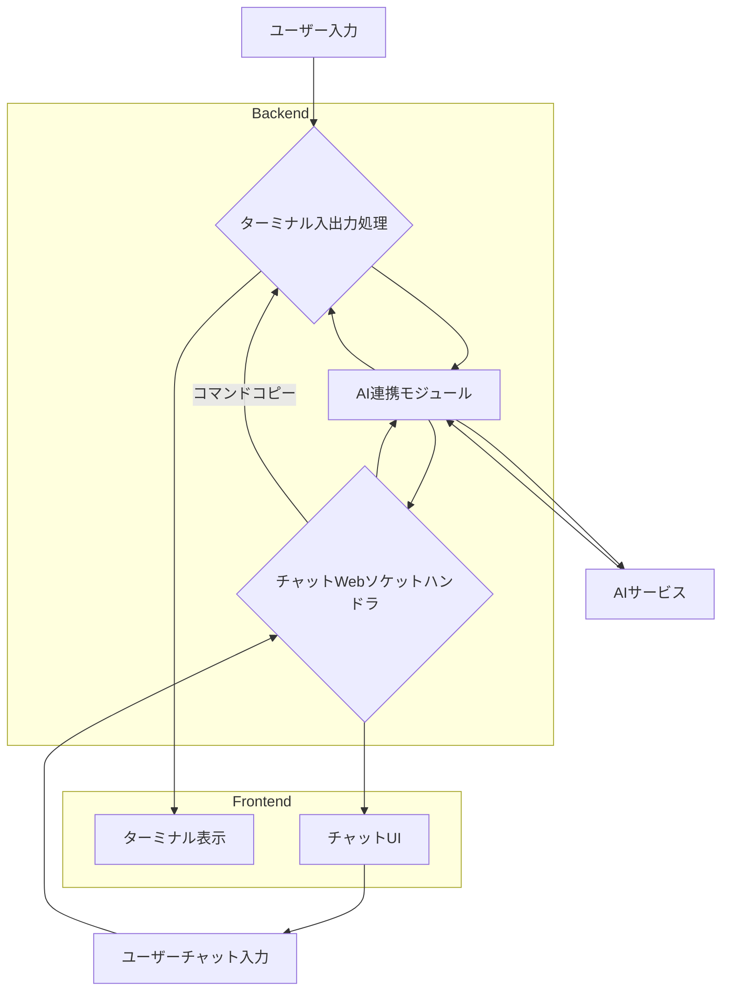

# AI連携とチャット機能の実装計画

本プロジェクトはWebベースのターミナルを提供するアプリであり、これを改造して入出力をAIに行わせ、解析とユーザーへの提案を行う機能を追加します。そのために、以下のステップで実装を進めます。

## 1. AI連携モジュールの作成

ターミナルの入出力をAIに送信し、AIからの応答を受け取るための新しいPythonモジュールを作成します。

### 目的
* ターミナルからの入出力データをAIサービスに送信する。
* AIサービスからの解析結果や提案を受け取る。
* AIサービスとの通信プロトコルを定義・実装する。

### 詳細
* `butterfly/ai_integration.py` のような新しいファイルを作成します。
* このモジュールは、AIサービスへのAPI呼び出しを抽象化するクラスまたは関数群を提供します。
* 初期段階では、ダミーのAI応答を返すように実装し、後で実際のAIサービス（例: OpenAI API, Gemini APIなど）と連携させます。

## 2. ターミナル入出力のAIへのルーティング

ユーザー入力をAI連携モジュールに送信し、AIからの応答をターミナルに書き込むように変更します。また、ターミナルからの出力もAI連携モジュールに送信し、解析させます。

### 目的
* ユーザーのターミナル入力をAIに渡し、AIが生成したコマンドや応答をターミナルに反映させる。
* ターミナルからの出力をAIに渡し、解析させる。

### 詳細
* `butterfly/terminal.py` や `butterfly/routes.py` など、ターミナルの入出力処理に関連する既存のファイルを特定し、変更を加えます。
* ユーザーがターミナルに入力した内容をフックし、AI連携モジュールに送信します。
* AI連携モジュールからの応答（例: 実行すべきコマンド、提案など）をターミナルに書き込むロジックを追加します。
* ターミナルからの出力（例: コマンドの実行結果）をAI連携モジュールに送信する仕組みを実装します。

## 3. チャット機能の実装

新しいWebソケットハンドラを作成し、AIとのチャットインターフェースを提供します。チャットからターミナルへのコマンドコピー機能も実装します。

### 目的
* ユーザーがAIと自然言語で対話できるチャットインターフェースを提供する。
* チャットでAIが提案したコマンドを、簡単にターミナルにコピーできるようにする。

### 詳細
* `butterfly/chat_routes.py` のような新しいファイルを作成し、チャット用のWebソケットハンドラを定義します。
* このハンドラは、チャットメッセージをAI連携モジュールに渡し、AIからの応答をチャットクライアントに返します。
* チャットメッセージの履歴管理や、AIからの提案を整形して表示するロジックを実装します。
* チャットインターフェースからターミナルへのコマンドコピー機能は、フロントエンドと連携して実装します。

## 4. フロントエンドの変更

チャットUIを追加し、新しいチャットWebソケットとの通信、AIからの提案の表示、およびチャットからのコマンドコピー機能を実装します。

### 目的
* ユーザーがAIと対話するための直感的なUIを提供する。
* AIからの提案を明確に表示し、ユーザーが簡単に利用できるようにする。

### 詳細
* `butterfly/templates/index.html` を変更し、チャットUI（入力フィールド、メッセージ表示エリアなど）を追加します。
* `coffees/main.coffee` や `coffees/term.coffee` など、既存のフロントエンドJavaScript/CoffeeScriptファイルを変更または新しいファイルを追加し、チャットWebソケットとの通信ロジックを実装します。
* AIからの提案をチャットUIに表示するロジックを実装します。
* チャット内の提案されたコマンドをクリックまたはドラッグ＆ドロップでターミナルにコピーできる機能を実装します。

## 5. Dependency-Injectorの導入

既存のコードを壊さないように、依存性注入（Dependency Injection）ライブラリである `dependency-injector` を導入し、各コンポーネントの結合度を低減させます。

### 目的
* 各コンポーネント（例: AI連携モジュール、ターミナルハンドラ、チャットハンドラ）間の依存関係を明確にし、テスト容易性と保守性を向上させる。
* 将来的な機能拡張やAIサービスの切り替えを容易にする。

### 詳細
* `requirements.txt` に `dependency-injector` を追加します。
* アプリケーションのエントリポイント（例: `butterfly.server.py`）でコンテナをセットアップし、必要な依存関係を注入するようにコードをリファクタリングします。
* 特に、AI連携モジュールを他のコンポーネントに注入できるように設計します。

## 計画のフロー図



## 依存関係の管理（Dependency Injection）

```mermaid
graph TD
    A[Application] --> B[AIIntegrationModule];
    A --> C[TerminalHandler];
    A --> D[ChatWebSocketHandler];

    B -- uses --> E[AIServiceClient];
    C -- uses --> B;
    D -- uses --> B;

    subgraph Dependency Container
        A;
    end